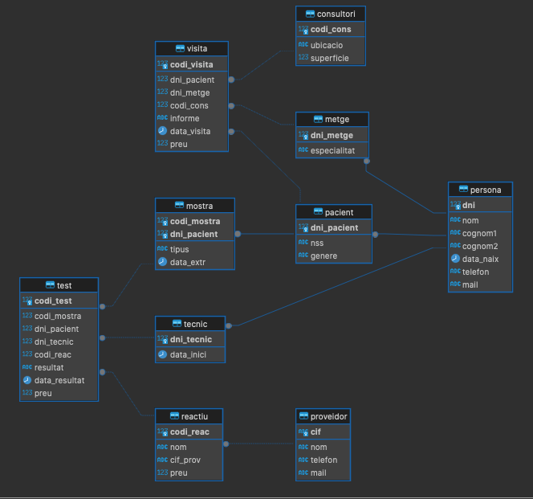
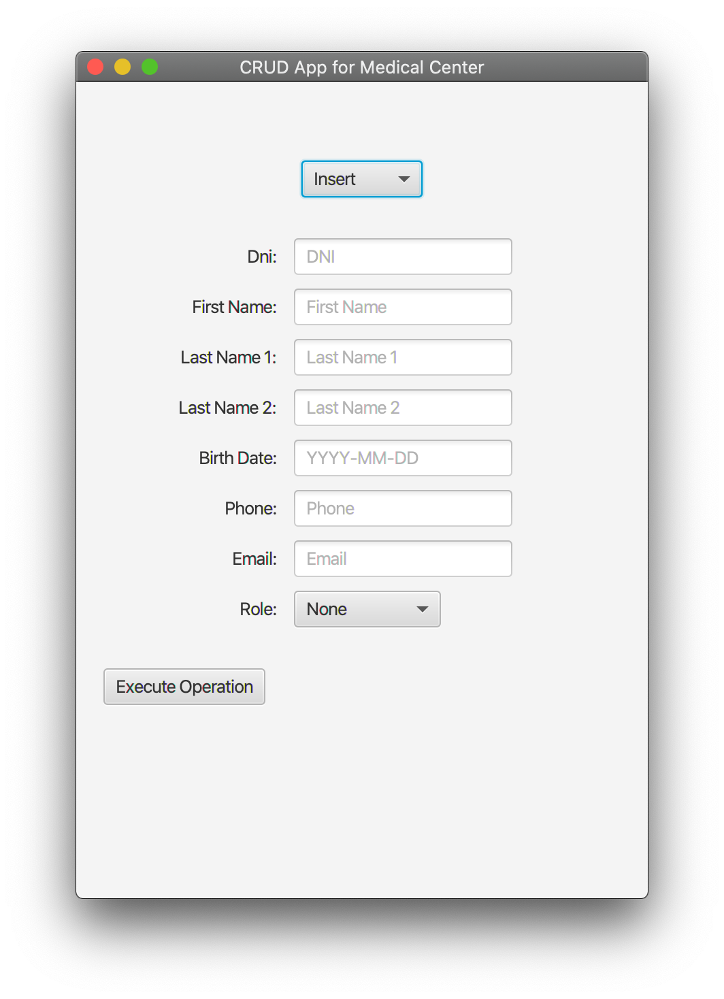
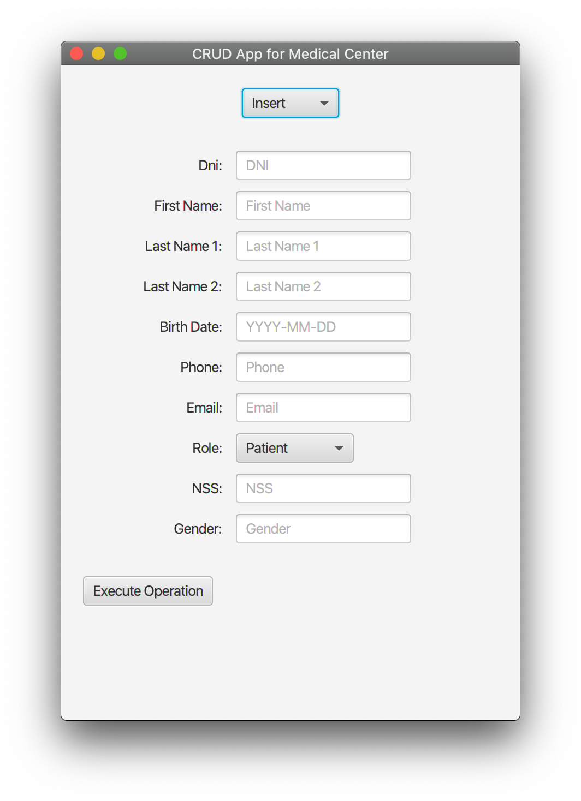
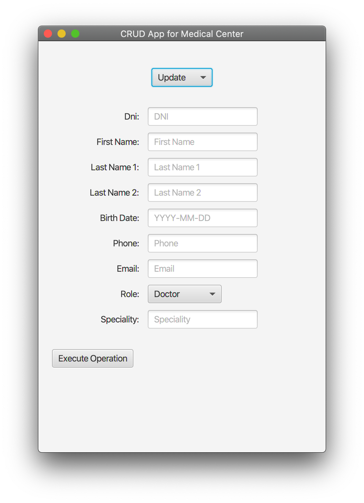
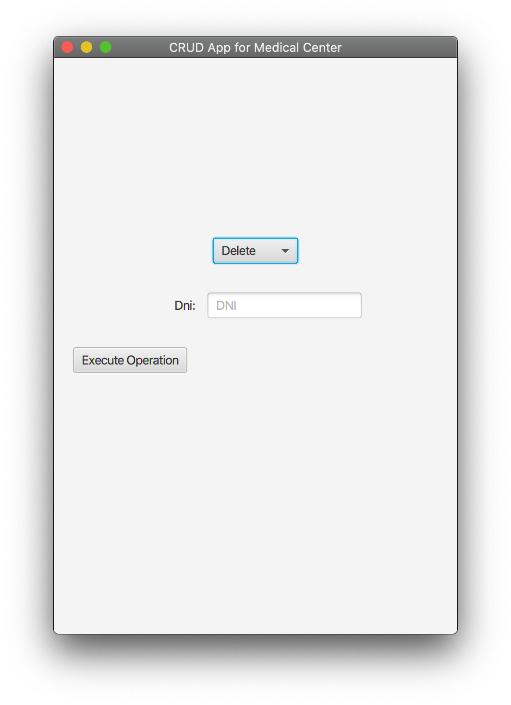
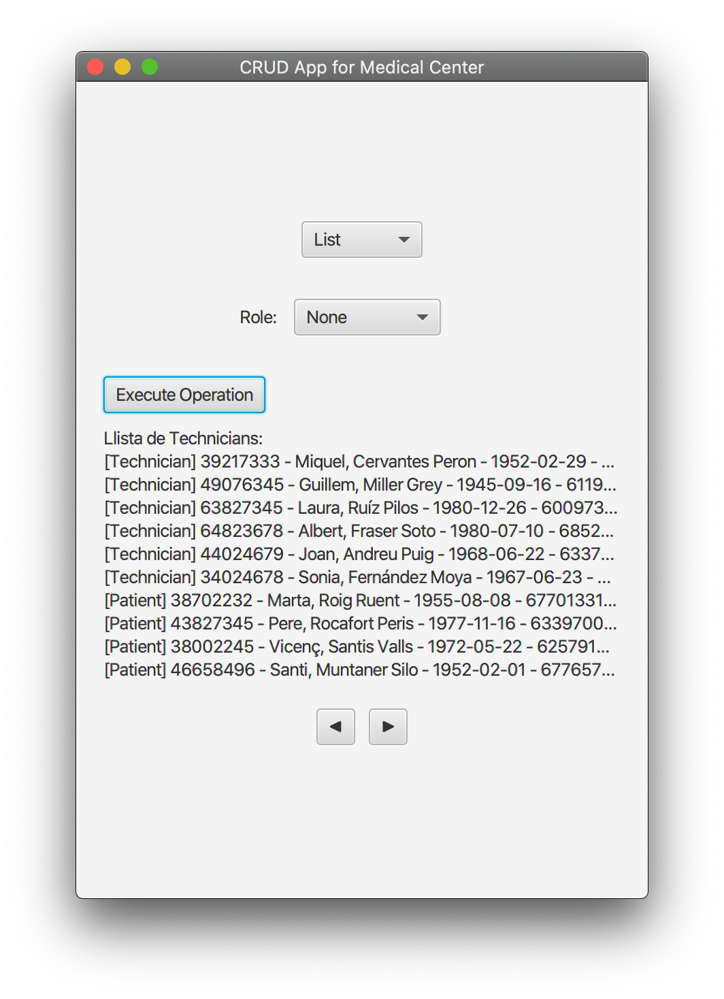
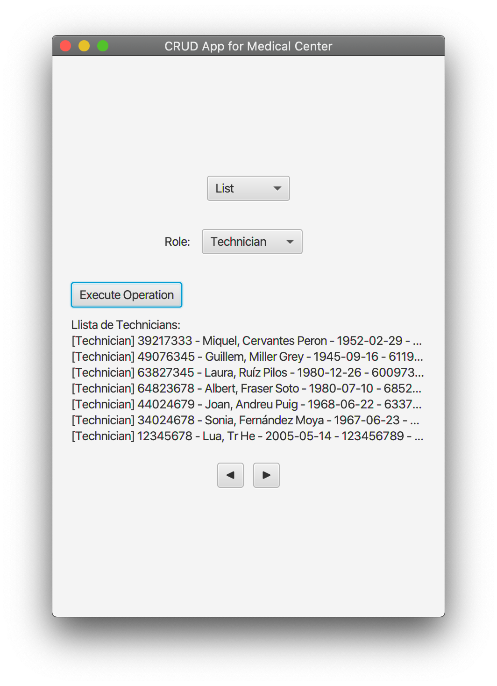

# Kotlin JavaFX CRUD Project

This project is a desktop app in Kotlin that allows managing clients through CRUD operations (Create, Read, Update, Delete) in a PostgreSQL database.

## 📃Table of Contents
## 📑 Table of Contents
- [Requirements](#-requirements)
- [How to run](#-how-to-run)
- [Functionality](#-functionality)
  - [PersonaService Class](#personaservice-class)
  - [GUI Components](#gui-components)
  - [Captures](#captures)
## 🏗 Requirements

- IntelliJ IDEA
- JDK 17+
- PostgreSQL running on localhost:
  - You must specify the connection data in `Database.kt`
    - Database: ds2
    - User: ds2
    - Password: ds2
  - You must execute the SQL script in `db/cemed.sql` to create the needed tables and inserts some example data.

> This is the database schema used in the project:
> 


## 🛠 How to run

1. Open the project in IntelliJ IDEA (`File > Open...`).
2. Wait for Gradle to sync.
3. Open `Main.kt` and click ▶️ to run the app.

## 🚀 Functionality

This application provides a graphical user interface for managing clients through CRUD operations (Create, Read, Update, Delete) in a PostgreSQL database.

I centered the development in the people managment because I think it is the complex part of OOP to implement. It has a basic table and then 3 specialized classes that extend the base class. (Doctors, Technicians and Patients).

### PersonaService Class
This class is responsible for managing the CRUD operations for the PERSONA table and its derived classes (Doctor, Technician, Patient).

#### `insertPersona`

This statement inserts a new person into the PERSONA table with the provided values for dni, nom, cognom1, cognom2, data_naix, telefon, and mail.
```sql
INSERT INTO PERSONA (dni, nom, cognom1, cognom2, data_naix, telefon, mail) VALUES (?, ?, ?, ?, ?, ?, ?)
```

#### `insertDoctor`

This statement inserts a new doctor into the METGE table with the provided values for dni_metge and especialitat.
```sql
INSERT INTO METGE (dni_metge, especialitat) VALUES (?, ?)
```

#### `insertPatient`

This statement inserts a new patient into the PACIENT table with the provided values for dni_pacient, nss, and genere.
```sql
INSERT INTO PACIENT (dni_pacient, nss, genere) VALUES (?, ?, ?)
```


#### `insertTechnician`

This statement inserts a new technician into the TECNIC table with the provided values for dni_tecnic and data_inici.
```sql
INSERT INTO TECNIC (dni_tecnic, data_inici) VALUES (?, ?)
```


#### `updatePersona`
This statement updates the data of a person in the PERSONA table. It uses the `COALESCE` function to keep existing values if new values are not provided.
```sql
UPDATE PERSONA SET
nom = COALESCE(?, nom),
cognom1 = COALESCE(?, cognom1),
cognom2 = COALESCE(?, cognom2),
data_naix = COALESCE(?, data_naix),
telefon = COALESCE(?, telefon),
mail = COALESCE(?, mail)
WHERE dni = ?
```


#### `deletePersona`

This statement deletes a person from the PERSONA table based on the provided dni.
```sql
DELETE FROM PERSONA WHERE dni = ?
```

#### `listPersonas`

This statement selects a list of people from the PERSONA table and their specific role data (doctor, patient, or technician) from the corresponding tables (METGE, PACIENT, TECNIC). It limits the results to 10 records with an offset for pagination.

```sql
SELECT p.dni as dni, p.nom, p.cognom1, p.cognom2, p.data_naix, p.telefon, p.mail, r.*
FROM PERSONA p
JOIN {roleTable} r ON p.dni = r.{roleColumn}
LIMIT 10 OFFSET ?
```

#### `getRegistersCount`
This statement counts the total number of records in the PERSONA table.

```sql
SELECT COUNT(*) FROM PERSONA
```
This statement counts the total number of records in the PERSONA table that have a specific role (doctor, patient, or technician) based on the corresponding tables (METGE, PACIENT, TECNIC).

```sql
SELECT COUNT(*)
FROM PERSONA p
JOIN {roleTable} r ON p.dni = r.{roleColumn}
```
[Back to top](#-table-of-contents)
### GUI Components

- **Buttons**:
  - `nextButton`: A button labeled with "▶️" to navigate to the next set of records.
  - `prevButton`: A button labeled with "◀️" to navigate to the previous set of records.
  - `executeButton`: A button labeled with "Execute" to execute the current operation (e.g., create, update, delete).'

- **Containers**:
  - `buttonContainer`: An `HBox` that contains the `prevButton` and `nextButton`, initially hidden.
  - `labelsContainer`: A `VBox` that holds the labels for the form fields.
  - `inputContainer`: A `VBox` that holds the input fields for the form.

- **Form Fields**:
  - `dniField`: A `TextField` for entering the DNI.
  - `firstNameField`: A `TextField` for entering the first name.
  - `lastName1Field`: A `TextField` for entering the first last name.
  - `lastName2Field`: A `TextField` for entering the second last name.
  - `birthDateField`: A `TextField` for entering the birth date in YYYY-MM-DD format.
  - `phoneField`: A `TextField` for entering the phone number.
  - `emailField`: A `TextField` for entering the email address.
  - `roleSelector`: A `ComboBox` for selecting the role (e.g., Doctor, Technician, Patient).

- **Additional Fields**: (Only shown when a specific role is selected)
  - For `Doctor`: A `TextField` for entering the speciality.
  - For `Patient`: Some `TextFields` for entering the NSS and gender.
  - For `Technician`: A `TextField` for entering the start date.

### Captures
#### ➕Insert


#### 🔁 Update


#### 🚮 Delete

#### 〰 List




[Back to top](#-table-of-contents)